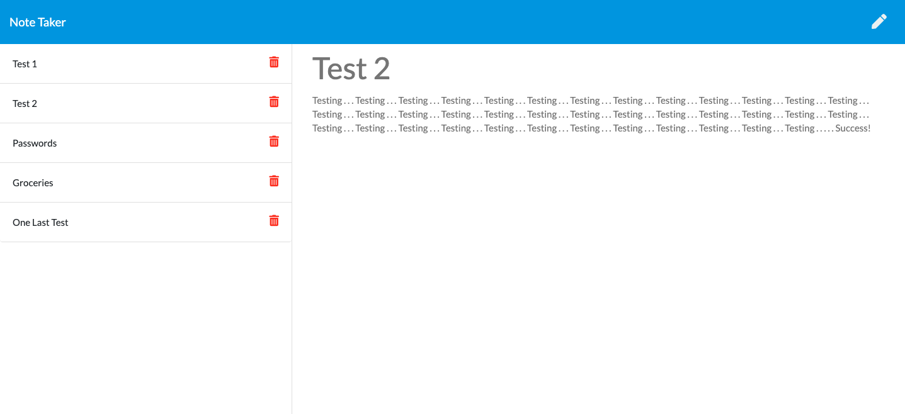

# Note-Taker

Link to the Deployed App: <https://damp-bastion-74766.herokuapp.com/>

## Description

A web application that let users write, save and delete notes. This is helpful for people who have a lot of information to keep track of and lets them organize that info for reference when the time comes. All saved notes will appear to the left of the page and can be viewed or deleted.

## Table of Contents

* [Installation](#Installation)
* [Usage](#Usage)
* [Questions](#Questions)
* [License](#License)

## Installation

Install node and then npm install packages 'express' and 'path'.

## Usage

* Click 'Get Started' to begin. To create a new note, enter a title and text for that note.
* To save, click the save button that will appear next to the pencil icon located at the top right of the page.
* To view previous notes, click on their name in the left sidebar.
* To delete a note, click the red trash icon next to that note.

## Questions

* Github: <https://github.com/andrewyen64>

* Email: andrewyen64@gmail.com

## License

GNU_v3.0 License

Copyright © 2020 Andrew Yen

[Link to License](LICENSE)
